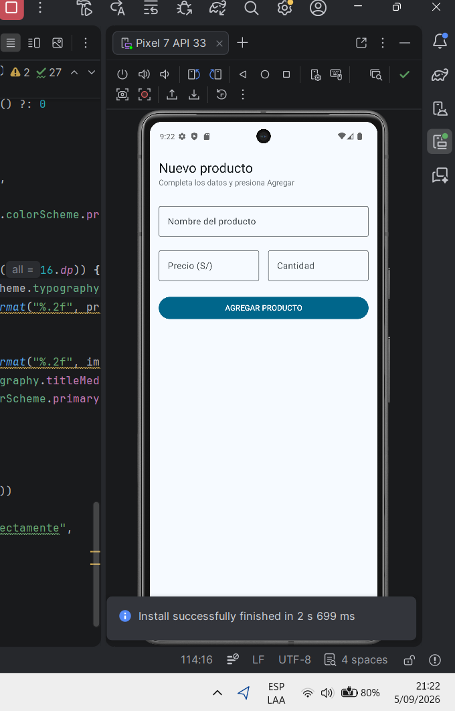
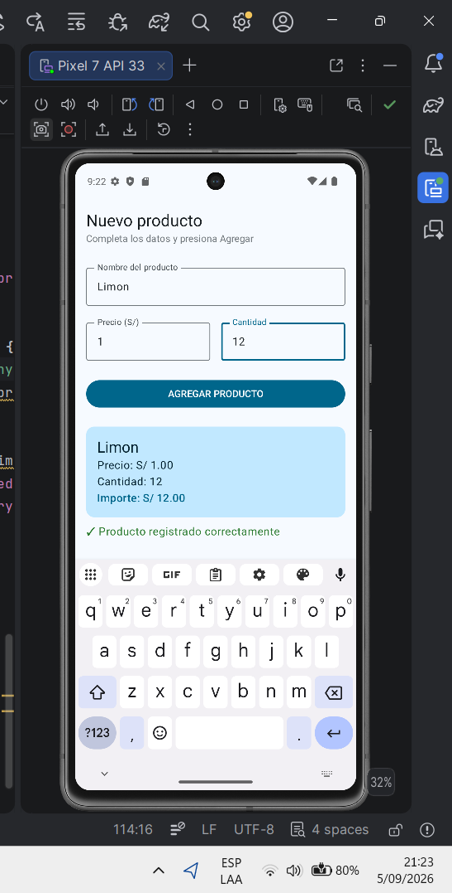

# Lab03 - Registro de Producto (Jetpack Compose)

**Alumno:** IVAN JARA AYALA
**Curso:** Programación en Móviles - 4to Ciclo
**Docente:** Juan León

## Descripción
Aplicación desarrollada en Jetpack Compose que permite registrar un producto
ingresando su nombre, precio y cantidad. Al presionar "AGREGAR PRODUCTO" se
muestra una Card con el resumen del producto y el importe total calculado
(precio × cantidad, con 2 decimales).

## Capturas

### Pantalla inicial (formulario vacío)

### Después de presionar AGREGAR PRODUCTO

## Reflexión

**¿Qué pasaría si declaras las variables de los campos SIN `remember`?**

Al quitar `remember` y dejar solo `mutableStateOf("")`, el campo de texto
deja de conservar su valor correctamente entre recomposiciones. Al escribir
se ve el texto momentáneamente, pero en cuanto Compose vuelve a ejecutar la
función `PantallaRegistro` (por ejemplo al rotar la pantalla o al cambiar
el tamaño de la ventana), el estado se reinicia a su valor inicial (`""`)
porque se crea una nueva variable de estado en cada recomposición.
`remember` es lo que le dice a Compose que debe conservar ese valor mientras
el composable permanezca en pantalla, en lugar de recrearlo desde cero.

## Mejora con IA

Se trabajó en la rama `mejora-ia` usando Gemini para agregar validación de
campos vacíos y un botón para limpiar el formulario.

| Prompt que usé | Qué generó Gemini | Qué acepté o corregí (y por qué) |
|---|---|---|
| "Tengo un composable de Jetpack Compose llamado PantallaRegistro con los estados nombre, precio, cantidad y mostrarResumen... Necesito que agregues: (1) validación de campos vacíos que muestre un mensaje en rojo en vez de la Card, y (2) un botón LIMPIAR que vacíe todos los campos. No cambies nada más de la pantalla." | La lógica de validación con `isBlank()` en el botón AGREGAR, el estado `mostrarError`, el `Text` en rojo condicional, y un segundo `Button` "LIMPIAR" que resetea los 3 campos y ambos estados booleanos. | Acepté toda la lógica de validación tal cual, porque cumplía exactamente lo pedido. Corregí que los botones AGREGAR y LIMPIAR no tenían `Modifier.fillMaxWidth()` (Gemini los generó a tamaño por defecto), y agregué `Spacer` entre el botón, el mensaje de error, el botón LIMPIAR y la Card, porque Gemini no respetó el espaciado de 16.dp que exige la regla de diseño del laboratorio. |

**Commits de esta parte:**
- `Aplica mejora generada con IA: validacion y boton limpiar` (código tal cual lo generó Gemini)
- `Corrige codigo de la IA: agrega fillMaxWidth a los botones y espaciados entre elementos` (mis correcciones)