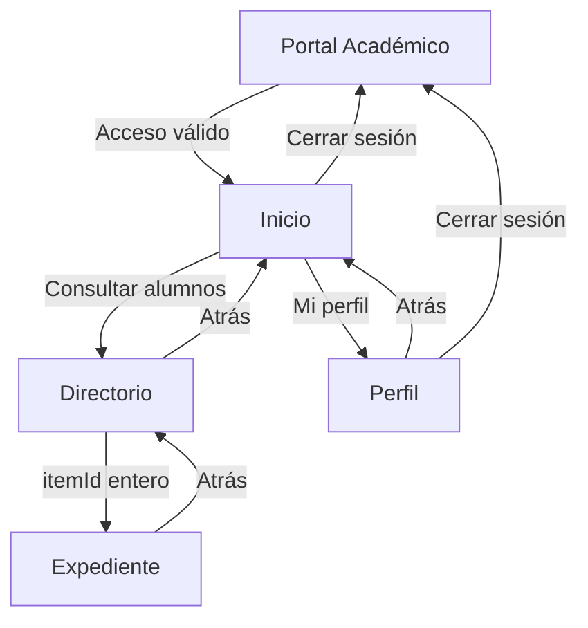

# Semana 05 · Portal Académico

Aplicación académica para Android desarrollada con **Kotlin, Jetpack Compose, Material 3 y Navigation Compose**. El trabajo aplica la navegación entre pantallas del laboratorio GLAB-S05 y desarrolla una propuesta visual de portal académico con apoyo de Gemini en Android Studio.

| Información | Detalle |
| --- | --- |
| Estudiante | Iván Jara Ayala |
| Docente | Suyon |
| Curso | Programación Móviles |
| Laboratorio | GLAB-S05 · Navegación en Jetpack Compose |
| Proyecto | `Semana05` · nombre mostrado en Android Studio: `lab05` |
| Paquete | `com.jara.lab05` |
| Plataforma | Android |
| Modalidad | Demostración local con datos de ejemplo |

[Proyecto en GitHub](https://github.com/JARA20022/Programacion_Moviles_Jara/tree/main/Semana05) · [Historial de commits](https://github.com/JARA20022/Programacion_Moviles_Jara/commits/main/)

## Contenido

- [Objetivo y alcance](#objetivo-y-alcance)
- [Trabajo del laboratorio y mejora visual](#trabajo-del-laboratorio-y-mejora-visual)
- [Pantallas y funcionalidades](#pantallas-y-funcionalidades)
- [Requerimientos funcionales](#requerimientos-funcionales)
- [Tecnologías y configuración](#tecnologías-y-configuración)
- [Organización del proyecto](#organización-del-proyecto)
- [Instalación y ejecución](#instalación-y-ejecución)
- [Cómo utilizar la aplicación](#cómo-utilizar-la-aplicación)
- [Flujo de navegación](#flujo-de-navegación)
- [Datos e imágenes](#datos-e-imágenes)
- [Diseño visual](#diseño-visual)
- [Verificación y criterios de aceptación](#verificación-y-criterios-de-aceptación)
- [Limitaciones](#limitaciones)
- [Uso de Gemini y prompt utilizado](#uso-de-gemini-y-prompt-utilizado)
- [Referencias](#referencias)

## Objetivo y alcance

Aplicar la navegación declarativa en Jetpack Compose mediante rutas, un `NavHost`, un `NavController` y el envío de un identificador entero a una pantalla de detalle. Sobre esa base se plantea una interfaz académica que permite acceder con credenciales de demostración, consultar alumnos, abrir su expediente y revisar el perfil del estudiante principal.

Este README documenta el alcance del PDF y del prompt utilizado para la mejora. Los criterios de aceptación permiten contrastar ese alcance con la aplicación ejecutada; no constituyen un reporte de pruebas aprobadas.

El portal está orientado a **consulta y navegación**. Los textos “gestionar estudiantes” y “Configuración de Perfil” forman parte de la interfaz, pero el alcance de esta versión no incluye crear, editar o eliminar alumnos ni modificar el perfil.

## Trabajo del laboratorio y mejora visual

La guía `GLAB-S05-JLEONS-2026-2.pdf` presenta primero la aplicación básica de navegación y, en sus páginas 18 y 19, solicita utilizar Gemini para mejorar su presentación.

| Etapa | Trabajo |
| --- | --- |
| Creación del proyecto | Configuración de un proyecto Android en Android Studio. |
| Dependencias | Incorporación de Navigation Compose y sincronización de Gradle. |
| Organización | Separación de rutas, navegación y pantallas en paquetes. |
| Rutas | Definición de destinos mediante una `sealed class Screen`. |
| Navegación | Conexión de los destinos en `AppNavigation.kt` e integración desde `MainActivity.kt`. |
| Pantallas base | Desarrollo de `HomeScreen`, `ListScreen`, `DetailScreen` y `ProfileScreen`. |
| Paso de argumentos | Apertura del detalle con `itemId` de tipo entero. |
| Actividad final | Elaboración de un prompt para mejorar la interfaz mediante Gemini. |

La mejora especificada incorpora una pantalla de acceso, rediseña las cuatro pantallas base, utiliza una paleta morada y lavanda, integra cinco retratos locales y personaliza la información de Iván Jara Ayala.

## Pantallas y funcionalidades

| Pantalla | Función | Acciones principales |
| --- | --- | --- |
| Portal Académico · `LoginScreen` | Acceso de demostración. | Ingresar correo y contraseña, alternar visibilidad, iniciar sesión y abrir el diálogo de recuperación. |
| Inicio · `HomeScreen` | Punto de entrada a las consultas académicas. | Abrir el directorio, abrir el perfil y cerrar sesión. |
| Directorio de Alumnos · `ListScreen` | Mostrar cinco alumnos con fotografía, nombre y carrera. | Seleccionar un alumno y regresar al inicio. |
| Expediente Académico · `DetailScreen` | Consultar la información del alumno seleccionado. | Ver ID, correo, facultad y biografía; regresar al directorio. |
| Configuración de Perfil · `ProfileScreen` | Consultar los datos personales y académicos de Iván. | Revisar nombre, correo, teléfono, carrera y ciclo; regresar o cerrar sesión. |

## Requerimientos funcionales

Los siguientes requerimientos se derivan de la guía y del prompt. La columna de aceptación describe el resultado esperado al comprobar la aplicación.

| ID | Requerimiento | Criterio de aceptación |
| --- | --- | --- |
| RF-01 | Mostrar el acceso como destino inicial. | Al iniciar el flujo de la aplicación aparece Portal Académico con ambos campos vacíos. |
| RF-02 | Validar los datos de acceso. | Los campos vacíos y las credenciales incorrectas muestran un aviso y no abren Inicio. |
| RF-03 | Permitir el acceso de demostración. | El correo y la contraseña indicados en este README abren Inicio y retiran Login del historial. |
| RF-04 | Alternar la visibilidad de la contraseña. | El control del ojo muestra u oculta el valor sin borrarlo. |
| RF-05 | Informar sobre la recuperación de contraseña. | El enlace abre un diálogo que aclara que la demostración no envía correos. |
| RF-06 | Mostrar una bienvenida personalizada. | Inicio muestra “Bienvenido, Iván” y permite abrir Directorio y Perfil. |
| RF-07 | Listar los alumnos de demostración. | El directorio contiene los cinco registros, en el orden definido y con su propia imagen. |
| RF-08 | Abrir el expediente por identificador. | Al seleccionar un alumno, el `itemId` entero determina los datos y la imagen mostrados. |
| RF-09 | Gestionar un identificador inexistente. | El detalle muestra “Alumno no encontrado” y permite regresar. |
| RF-10 | Consultar el perfil principal. | Perfil presenta los datos de Iván, su teléfono `902104462` y su carrera. |
| RF-11 | Mantener una navegación de regreso coherente. | Detail vuelve a List; List y Profile vuelven a Home. |
| RF-12 | Cerrar la sesión de demostración. | El cierre desde Home o Profile vuelve a Login y elimina los destinos autenticados del historial. |
| RF-13 | Mantener la identidad visual de cada alumno. | Un alumno utiliza el mismo retrato en el directorio y su expediente; Iván también lo reutiliza en Perfil. |
| RF-14 | Conservar los valores del formulario durante la recreación de la interfaz. | La recreación no borra los campos por una recomposición o cambio de configuración contemplado por la implementación. |
| RF-15 | Evitar navegación duplicada por pulsaciones repetidas. | Varias pulsaciones no generan una acumulación innecesaria del mismo destino. |

## Tecnologías y configuración

| Tecnología | Uso |
| --- | --- |
| Kotlin | Lógica, modelos y definición de pantallas. |
| Jetpack Compose | Construcción declarativa de la interfaz. |
| Material 3 | Tarjetas, barras, botones, campos y tema visual. |
| Navigation Compose | Destinos, historial de navegación y argumento `itemId`. |
| Gradle Kotlin DSL | Configuración y compilación del proyecto. |
| Recursos Android | Retratos e iconos locales mediante `R.drawable`. |
| Gemini en Android Studio | Asistencia en la implementación del diseño mediante el prompt incluido. |
| Git y GitHub | Control de versiones y registro de avances. |

### Configuración declarada en el prompt

| Parámetro | Valor declarado |
| --- | --- |
| `compileSdk` | 37 |
| `minSdk` | 24 |
| `targetSdk` | 36 |
| Navigation Compose | 2.7.7 |
| Iconos | `material-icons-core`, administrado por el BOM de Compose |

Estos valores proceden del prompt adjunto. Los archivos `app/build.gradle.kts`, `build.gradle.kts`, el catálogo de versiones si existe y `gradle/wrapper/gradle-wrapper.properties` son la referencia para conocer la configuración efectiva. No se debe cambiar una versión solo para hacerla coincidir con esta tabla si el proyecto utiliza otra configuración válida.

## Organización del proyecto

Las rutas siguientes son relativas a `Semana05/`. Los archivos Kotlin se ubican normalmente bajo `app/src/main/java/com/jara/lab05/`; Android Studio los agrupa en la vista **kotlin+java**.

| Archivo o directorio | Responsabilidad |
| --- | --- |
| `app/src/main/AndroidManifest.xml` | Declaración de la aplicación y su actividad. |
| `MainActivity.kt` | Entrada de la aplicación y aplicación del tema. |
| `navigation/Screen.kt` | Destinos y construcción de rutas. |
| `navigation/AppNavigation.kt` | Grafo de navegación y paso de argumentos. |
| `screens/LoginScreen.kt` | Formulario de acceso de la mejora. |
| `screens/HomeScreen.kt` | Bienvenida y accesos a las consultas. |
| `screens/ListScreen.kt` | Directorio de alumnos. |
| `screens/DetailScreen.kt` | Expediente del alumno seleccionado. |
| `screens/ProfileScreen.kt` | Datos del alumno principal. |
| `data/` | Organización prevista para los datos locales compartidos. |
| `components/` o `ui/components/` | Componentes reutilizables; usar la ubicación de la implementación. |
| `ui/theme/` | Colores, tema y tipografía. |
| `app/src/main/res/drawable/` | Retratos y recursos gráficos locales. |
| `app/build.gradle.kts` | Configuración del módulo `app`. |
| `settings.gradle.kts` | Módulos del proyecto. |
| `gradlew` y `gradlew.bat` | Gradle Wrapper para compilar. |
| `README.md` | Documentación del laboratorio, uso y prompt empleado. |

La carpeta `src` existe en la estructura física aunque no aparezca directamente en la vista **Android**. En esa vista, las imágenes se encuentran en **app → res → drawable**.

## Instalación y ejecución

### Requisitos previos

1. Android Studio compatible con el Android Gradle Plugin del proyecto.
2. El SDK solicitado por el `compileSdk` real, instalado desde SDK Manager.
3. Un JDK compatible con el plugin de Gradle del proyecto, seleccionado como Gradle JDK.
4. Un emulador o dispositivo Android compatible con el `minSdk` real; el prompt declara API 24 como mínimo.
5. Conexión a internet para clonar el repositorio y descargar dependencias durante la configuración inicial. La demostración académica utiliza datos e imágenes locales una vez instalada.

### Obtener el proyecto

Si todavía no se dispone del repositorio:

```powershell
git clone https://github.com/JARA20022/Programacion_Moviles_Jara.git
cd Programacion_Moviles_Jara\Semana05
```

Si ya está descargado en la ubicación del autor:

```powershell
Set-Location 'C:\Users\tuoga\OneDrive\Desktop\Programacion_Moviles_Jara\Semana05'
```

### Ejecutar desde Android Studio

1. Abrir la carpeta **Semana05**, que contiene el proyecto Android.
2. Esperar a que Gradle termine la sincronización; utilizar **Sync Now** si aparece después de un cambio de configuración.
3. Confirmar que los cinco archivos `perfil_*.png` estén en `app/src/main/res/drawable/`.
4. Seleccionar la configuración de ejecución del módulo **app**.
5. Elegir un emulador o conectar un dispositivo con depuración USB habilitada y autorización de depuración aceptada.
6. Pulsar **Run** y esperar a que se instale y abra la aplicación.

### Compilar desde PowerShell

Ejecutar desde **Semana05**, donde está `gradlew.bat`:

```powershell
.\gradlew.bat :app:assembleDebug
```

Para compilar e instalar en un emulador encendido o dispositivo conectado:

```powershell
.\gradlew.bat :app:installDebug
```

Después de la instalación se puede abrir la aplicación desde el dispositivo. En una configuración estándar sin variantes adicionales, el APK de depuración se genera en:

```text
app/build/outputs/apk/debug/app-debug.apk
```

En macOS o Linux se utiliza `./gradlew :app:assembleDebug` desde la misma carpeta del proyecto. Estos comandos usan el Gradle Wrapper incluido en el repositorio. Véase la [guía oficial de compilación](https://developer.android.com/build/building-cmdline).

### Problemas frecuentes

| Situación | Qué revisar |
| --- | --- |
| No se encuentra `gradlew.bat` | La terminal debe estar dentro de `Semana05`, no en la raíz que contiene todas las semanas. |
| Falta el SDK solicitado | Revisar `compileSdk` en Gradle e instalar la plataforma correspondiente desde SDK Manager. |
| Error de compatibilidad de Java | Revisar el Gradle JDK y su compatibilidad con la versión de Android Gradle Plugin utilizada. |
| `R.drawable` no encuentra un retrato | Confirmar nombre exacto, extensión PNG y ubicación directa dentro de `res/drawable`. |
| La app no aparece en el dispositivo | Comprobar el destino seleccionado, el resultado de instalación y la autorización de depuración USB. |
| El formulario queda oculto por el teclado | Verificar el tratamiento de insets y desplazamiento conforme al prompt. |

## Cómo utilizar la aplicación

### 1. Iniciar sesión

Introducir las credenciales de demostración:

| Campo | Valor |
| --- | --- |
| Correo | `ivan.jara.a@tecsup.edu.pe` |
| Contraseña | `Tecsup123` |

Pulsar **INICIAR SESIÓN**. El icono del ojo permite mostrar u ocultar la contraseña. Los datos vacíos o incorrectos deben producir un aviso sin abrir Inicio.

Estas credenciales están publicadas porque pertenecen a una demostración local. No corresponden a una integración con el sistema de autenticación institucional.

### 2. Consultar alumnos y expedientes

En Inicio, pulsar **Directorio de Alumnos**. Seleccionar uno de los cinco registros para abrir su expediente. Revisar la fotografía, el nombre, la carrera, el ID, el correo, la facultad y la biografía. Utilizar la flecha de regreso para volver al directorio.

### 3. Consultar el perfil

Desde Inicio, pulsar **Mi Perfil Académico**. La pantalla muestra los datos personales y académicos de Iván. Los valores se presentan como información de consulta, no como campos editables.

### 4. Consultar la recuperación de contraseña

Desde el acceso, pulsar **¿Olvidaste tu contraseña?**. Se muestra un diálogo informativo: esta demostración no envía correos ni modifica contraseñas.

### 5. Cerrar sesión

Pulsar **Cerrar Sesión Segura** en Inicio o **Cerrar Sesión** en Perfil. La aplicación debe volver al acceso. Al pulsar Atrás después del cierre no deben reaparecer las pantallas de la sesión anterior.

## Flujo de navegación



`Screen` define las rutas y `AppNavigation` conecta los destinos. El detalle recibe un `itemId` entero; la navegación debe resolver los datos a partir de ese ID. Se utiliza una única instancia de `NavController`, con eliminación de Login al acceder y del historial autenticado al cerrar sesión.

## Datos e imágenes

### Alumno principal

| Dato | Valor |
| --- | --- |
| Nombre | Iván Jara Ayala |
| Correo de demostración | ivan.jara.a@tecsup.edu.pe |
| Teléfono | 902104462 |
| Carrera | Desarrollo de Software |
| Ciclo | No registrado |
| ID de demostración | 2024-0001 |
| Facultad de demostración | Ingeniería y Tecnología |
| Biografía | Estudiante de Desarrollo de Software con interés en desarrollo Android. |

Suyon corresponde al docente y no al alumno principal.

### Directorio y recursos

| ID | Alumno | Carrera | Archivo |
| --- | --- | --- | --- |
| 1 | Iván Jara Ayala | Desarrollo de Software | `perfil_ivan_jara.png` |
| 2 | María García | Arquitectura | `perfil_maria_garcia.png` |
| 3 | Carlos Perez | Medicina | `perfil_carlos_perez.png` |
| 4 | Ana Lopez | Derecho | `perfil_ana_lopez.png` |
| 5 | Luis Ramirez | Administración | `perfil_luis_ramirez.png` |

<p>
  
  
  
  
  
</p>

Las imágenes son retratos ficticios generados para la demostración e inspirados en el estilo visual de la referencia. El retrato asignado a Iván no es una fotografía real suya. Los otros cuatro alumnos son registros de ejemplo.

Los recursos se encuentran en `app/src/main/res/drawable/` y se cargan mediante `painterResource` y `R.drawable`. Compose aplica el recorte circular y `ContentScale.Crop`; los archivos originales permanecen cuadrados. Tamaños previstos: **56 dp** en el directorio, **128 dp** en el expediente y **80 dp** en el perfil principal.

## Diseño visual

| Elemento | Especificación |
| --- | --- |
| Tema | Claro, con colores explícitos y sin colores dinámicos del dispositivo. |
| Morado principal | `#63509F`. |
| Fondo general | `#FDF8FE`. |
| Fondo del acceso | Degradado `#E6D9FA` → `#F0E6FC` → `#FBF5FE`. |
| Título y botón del acceso | `#6750A4`. |
| Tarjeta de acceso | Fondo `#E5E0E7`, esquinas de 20 dp y márgenes laterales de 24 dp en la referencia. |
| Campos y botón del acceso | Esquinas de 8 dp; botón de 48 dp de alto. |
| Directorio | Barra `#E8DDFB`, tarjetas con retratos circulares y datos del alumno. |
| Expediente | Cabecera degradada, retrato superpuesto y tarjeta de información. |
| Perfil | Cabecera degradada, filas compactas y cierre de sesión inferior. |
| Información compacta | Separación de 0–2 dp entre etiqueta y valor; aproximadamente 12 dp entre filas. |

Las medidas del prompt son objetivos aproximados para una composición de **360 × 800 dp**. El acceso debe centrarse dentro del área segura y permitir desplazamiento con el teclado abierto. El cierre de sesión de Inicio y Perfil debe permanecer abajo sin superponerse al contenido.

El prompt sitúa la bienvenida de Inicio aproximadamente al 20 % de la altura, el subtítulo al 33 % y la primera tarjeta al 37 %. La comparación visual compartida durante el desarrollo detectó que ese bloque estaba más arriba que en la referencia; su ajuste debe verificarse antes de declarar coincidencia visual completa.

## Verificación y criterios de aceptación

Esta lista está destinada a registrar la comprobación real sobre el emulador o dispositivo. **Las casillas están sin marcar porque este documento no acredita una ejecución de pruebas ni una compilación.** No se revisó el código remoto al preparar el README; la descripción se fundamenta en el PDF, el prompt y las capturas compartidas.

- [ ] Gradle sincroniza sin errores y `:app:assembleDebug` finaliza correctamente.
- [ ] La aplicación abre el acceso sin mostrar automáticamente el teclado.
- [ ] Campos vacíos y credenciales incorrectas no permiten entrar.
- [ ] Las credenciales de demostración abren Inicio.
- [ ] El ojo muestra y oculta la contraseña sin borrar su valor.
- [ ] El enlace de recuperación muestra el diálogo informativo.
- [ ] Login queda centrado con teclado cerrado y accesible mediante scroll al abrirlo.
- [ ] La bienvenida, el subtítulo y las tarjetas de Inicio coinciden con la distribución prevista.
- [ ] El directorio muestra los cinco alumnos y sus imágenes correctas.
- [ ] Cada tarjeta abre el expediente del alumno seleccionado.
- [ ] Un `itemId` inexistente muestra “Alumno no encontrado” y permite regresar.
- [ ] Perfil muestra los datos de Iván, incluido `902104462`.
- [ ] Las flechas Atrás siguen el recorrido indicado.
- [ ] El cierre de sesión funciona desde Home y Profile.
- [ ] Atrás no reabre pantallas autenticadas después de cerrar sesión.
- [ ] Los botones inferiores no quedan cubiertos por las barras del sistema.
- [ ] Los textos no se recortan ni superponen en 360 × 800 dp y en una pantalla más pequeña.
- [ ] Las imágenes se muestran sin conexión a internet durante el uso de la app.

## Limitaciones

- El acceso valida una cuenta de demostración local; no autentica contra un servidor ni protege información institucional real.
- No existe registro de usuarios, base de datos, Firebase ni sincronización remota dentro del alcance especificado.
- Recuperación de contraseña es un diálogo informativo, sin envío de correo.
- Directorio, expediente y perfil son pantallas de consulta; no incluyen operaciones de alta, edición o eliminación.
- “Ciclo Actual” se mantiene como “No registrado”; el ID, la facultad y los registros de ejemplo no acreditan información académica oficial.
- La conservación de una sesión después de cerrar el proceso de la app no forma parte del alcance definido.
- El grado de coincidencia con el PDF depende de la implementación, el dispositivo y la validación visual.

## Uso de Gemini y prompt utilizado

La actividad final del laboratorio propone usar Gemini para mejorar la presentación de la aplicación de navegación. El prompt especifica la interfaz, colores, navegación, datos, recursos locales y criterios de revisión.

Para reproducir el trabajo, abrir **Semana05** en Android Studio, disponer de los cinco PNG en `app/src/main/res/drawable/` y proporcionar a Gemini el texto completo siguiente. Revisar los cambios, ejecutar la aplicación y conservar las modificaciones que cumplan los criterios antes de registrarlas con Git.

El prompt se conserva tal como fue entregado en `Pasted text(5).txt`. Su ruta absoluta corresponde al equipo del autor; quien lo ejecute en otro equipo debe adaptar únicamente esa ruta a la ubicación de su copia. Este texto solicita la implementación completa sobre la base del laboratorio y no es un procedimiento de restauración de Git.

<details>
<summary><strong>Ver y copiar el prompt completo utilizado</strong></summary>

````text
Actúa como desarrollador Android sénior especializado en Kotlin, Jetpack Compose, Material 3 y diseño de interfaces. Implementa directamente en mi proyecto abierto el portal académico descrito en este prompt.

Este es un encargo completo y autónomo. Las imágenes de los perfiles están disponibles localmente en la ruta indicada en este prompt. Lee toda la especificación antes de editar y comprueba los criterios finales antes de terminar.

El trabajo corresponde a la actividad final del GLAB-S05: mejorar mediante Gemini la presentación de una aplicación de navegación.

**1. Inspección del proyecto y alcance**

Mi proyecto utiliza el paquete `com.jara.lab05` y contiene:

* `MainActivity.kt`.
* `navigation/Screen.kt`.
* `navigation/AppNavigation.kt`.
* `screens/HomeScreen.kt`.
* `screens/ListScreen.kt`.
* `screens/DetailScreen.kt`.
* `screens/ProfileScreen.kt`.
* Archivos de tema dentro de `ui.theme`.

La navegación utiliza una sealed class Screen, NavHost, NavController y un argumento entero itemId para el detalle.

Primero lee los archivos existentes, el tema y la configuración Gradle. Aprovecha esa estructura y modifica los archivos directamente. Añade LoginScreen y los archivos auxiliares necesarios.

La configuración corregida del proyecto utiliza compileSdk 37, minSdk 24, targetSdk 36, Navigation Compose 2.7.7 y material-icons-core administrado por el BOM de Compose. Conserva la configuración existente si funciona. No actualices versiones innecesariamente.

Trabaja exclusivamente dentro del proyecto Semana05, ubicado en:

`C:\Users\tuoga\OneDrive\Desktop\Programacion_Moviles_Jara\Semana05`

No modifiques otras semanas del repositorio. Conserva el paquete `com.jara.lab05`. Usa el proyecto abierto y su estructura; no crees otro proyecto ni una carpeta lab05 adicional.

Implementa una demostración local. No agregues Firebase, servidores, bases de datos, registro de usuarios ni servicios de autenticación.

**2. Datos del alumno principal**

Utiliza estos datos de manera consistente:

* Nombre completo: Iván Jara Ayala.
* Nombre corto: Iván.
* Correo: ivan.jara.a@tecsup.edu.pe.
* Carrera: Desarrollo de Software.
* Iniciales: IJA.
* Teléfono: 902104462.
* Ciclo actual: No registrado.
* ID de demostración: 2024-0001.
* Facultad de demostración: Ingeniería y Tecnología.
* Biografía: Estudiante de Desarrollo de Software con interés en desarrollo Android.

Centraliza la información para compartirla entre directorio, expediente y perfil.

Suyon es el profesor. No utilices su nombre, correo ni teléfono como información del alumno principal.

**3. Sistema visual**

La aplicación tendrá cinco pantallas:

1. Portal Académico.
2. Inicio.
3. Directorio de Alumnos.
4. Expediente Académico.
5. Configuración de Perfil.

Utiliza un tema claro explícito y desactiva los colores dinámicos del sistema.

Paleta obligatoria:

| Elemento                                    | Color     |
| ------------------------------------------- | --------- |
| Morado principal                            | `#63509F` |
| Fondo general                               | `#FDF8FE` |
| Barra lavanda del directorio                | `#E8DDFB` |
| Inicio del degradado de acceso              | `#E6D9FA` |
| Centro del degradado de acceso              | `#F0E6FC` |
| Final del degradado de acceso               | `#FBF5FE` |
| Título, botón y foco exclusivamente del acceso | `#6750A4` |
| Tarjeta de acceso y tarjetas del directorio | `#E5E0E7` |
| Tarjetas de inicio                          | `#FDF8FE` |
| Recuadros de iconos del inicio              | `#E7DCFA` |
| Tarjeta del expediente                      | `#F2EBF3` |
| Inicio del degradado del expediente         | `#63519B` |
| Final del degradado del expediente          | `#5F5975` |
| Izquierda del degradado del perfil          | `#65509B` |
| Derecha del degradado del perfil            | `#765462` |
| Fondo del botón de cerrar sesión            | `#F4DFDC` |
| Texto principal                             | `#28242C` |
| Texto secundario                            | `#625B71` |
| Etiquetas pequeñas                          | `#8D858F` |
| Bordes discretos                            | `#938B96` |
| Divisores                                   | `#D5CDD8` |
| Texto e iconos de cerrar sesión             | `#A65A52` |
| Texto sobre fondos morados                  | `#FFFFFF` |

Centraliza estos colores. Configura explícitamente los colores de tarjetas, botones y barras. Evita que los tintes automáticos de elevación alteren la paleta.

Tipografía:

* Familia sans serif del sistema, equivalente a Roboto.
* Títulos principales: 24 sp, negrita, interlineado de 28 sp.
* Bienvenida: 28 sp, negrita, interlineado de 32 sp.
* Títulos de barra: 20 sp, seminegrita.
* Nombres del directorio: 16 sp, negrita.
* Textos descriptivos: 12–14 sp.
* Encabezados de sección: 11 sp, negrita, mayúsculas y letterSpacing de 0.8 sp.
* En etiquetas y valores informativos usa letterSpacing de 0 sp para mantenerlos compactos.

Proporciones:

* Usa una pantalla vertical de 360 × 800 dp como referencia de composición, incluyendo las barras del sistema.
* Adapta el diseño a otras dimensiones mediante constraints y contenedores flexibles.
* El fondo ocupa toda la pantalla.
* El contenido respeta los insets de sistema una sola vez.
* Conserva el espacio vacío intencional.
* No dibujes un teléfono, cámara frontal, reloj, batería ni barra de gestos.
* No agregues navegación inferior, buscador, menú lateral, botón flotante, logotipo ni contenido decorativo adicional.

**4. Componentes compartidos: etiquetas, valores e iconos**

Crea un componente reutilizable para las parejas de etiqueta y valor del expediente y del perfil.

La etiqueta y su valor deben quedar VISUALMENTE JUNTOS, como un bloque compacto de dos líneas.

Especificación:

* Etiqueta: 10 sp, lineHeight de 12 sp, color `#8D858F`.
* Valor: 12–14 sp, lineHeight de 14–16 sp, seminegrita, color `#28242C`.
* Separación interna: 0–2 dp como máximo.
* Ambos textos alineados a la izquierda.
* El contenedor de textos debe medir únicamente lo que necesita su contenido.
* No uses altura fija en cada Text.
* No uses padding vertical individual.
* No uses SpaceBetween ni SpaceEvenly dentro de la pareja.
* No coloques un Spacer de 8, 12 o 16 dp entre etiqueta y valor.
* Elimina el padding adicional de la fuente donde corresponda, por ejemplo mediante PlatformTextStyle con includeFontPadding desactivado.
* Permite ajustar los valores largos a otra línea sin superposiciones.

Distingue dos separaciones:

* DENTRO de la pareja etiqueta/valor: 0–2 dp.
* ENTRE filas informativas completas: aproximadamente 12 dp.

El icono debe quedar centrado verticalmente respecto al bloque completo de etiqueta y valor. Deja 12 dp entre el icono y los textos.

Iconografía obligatoria:

* Directorio: grupo de personas.
* Perfil o nombre: silueta de persona.
* ID Estudiante: credencial de identificación con una pequeña silueta.
* Correo: sobre.
* Contraseña: candado.
* Visibilidad de contraseña: ojo y ojo tachado.
* Facultad y Carrera: birrete académico.
* Teléfono: auricular telefónico.
* Ciclo Actual: calendario.
* Cerrar sesión: puerta o marco con flecha de salida.
* Regresar: flecha hacia atrás.
* Abrir alumno: chevrón hacia la derecha.

NO sustituyas:

* Grupo de personas por una lista de líneas.
* Credencial por un círculo con “i”.
* Birrete por una estrella.
* Calendario por un círculo de información.

Usa un estilo Material relleno consistente. Comprueba qué iconos existen en las dependencias actuales. Si falta uno, agrega un vector drawable local adecuado. No introduzcas imports inexistentes ni utilices emojis.

**5. Pantalla de acceso: Portal Académico**

Crea LoginScreen siguiendo la composición de la pantalla de acceso de la página 18 del PDF: fondo lavanda claro, tarjeta gris lavanda centrada, título morado, dos campos con borde y botón morado. Las medidas siguientes son objetivos de implementación para reproducir visualmente la referencia.

Fondo y colores exclusivos de esta pantalla:

* Degradado vertical continuo de tres puntos: `#E6D9FA` al 0 %, `#F0E6FC` al 50 % y `#FBF5FE` al 100 % de la altura.
* El tono lavanda debe apreciarse claramente arriba y aclararse progresivamente abajo. No uses un fondo blanco uniforme ni un morado oscuro en toda la pantalla.
* Extiende el fondo por toda la pantalla, independientemente de la altura del formulario.
* Sin TopAppBar, logotipo, ilustraciones ni elementos adicionales.
* Tarjeta: `#E5E0E7`, color sólido y opaco.
* Título, botón y borde de campo con foco: `#6750A4`.
* Texto introducido: `#28242C`.
* Subtítulo, placeholders, iconos y recuperación: `#625B71`.
* Bordes sin foco: `#938B96`.
* Texto del botón: blanco `#FFFFFF`.
* Define los colores del Login de forma explícita. No sustituyas el morado principal de las demás pantallas por el color exclusivo del acceso.

Posición y tamaño de la tarjeta:

* Centra la tarjeta COMPLETA horizontal y verticalmente dentro del área segura disponible, con el teclado oculto.
* El contenedor raíz ocupa toda la pantalla mediante fillMaxSize y recibe una altura finita. Centrar los textos dentro de la tarjeta no sustituye centrar la tarjeta en la pantalla.
* En la referencia de 360 × 800 dp: centro horizontal x = 180 dp, ancho 312 dp y márgenes laterales de 24 dp.
* Altura orientativa de 372 dp, adaptable al contenido. Con barras del sistema de alturas similares, el centro queda cerca de y = 400 dp y la tarjeta aproximadamente entre y = 214 y y = 586 dp. Usa estas coordenadas para comparar, nunca como offsets fijos.
* El espacio libre por encima y por debajo de la tarjeta debe ser visualmente equivalente dentro del área segura. No alinees el formulario al borde superior ni al tercio superior.
* En pantallas más anchas, conserva al menos 24 dp laterales y limita el ancho de la tarjeta a 400 dp.
* La tarjeta ajusta su altura al contenido; no uses fillMaxHeight ni una altura fija que corte elementos.
* Esquinas de 20 dp, elevación suave de 6 dp y sin borde oscuro.
* Padding interior horizontal de 20 dp y vertical de 24 dp.
* En una pantalla de 360 dp, los campos y el botón tendrán aproximadamente 272 dp de ancho.
* Evita tintes automáticos de elevación que modifiquen el fondo de la tarjeta.

Centrado, desplazamiento e insets:

* Aplica los insets de las barras del sistema una sola vez. Revisa si el Scaffold superior ya entrega ese espacio mediante innerPadding.
* Obtén la altura finita del área disponible antes de introducir desplazamiento vertical, por ejemplo con BoxWithConstraints.
* El contenido desplazable debe tener como altura mínima la del área disponible y centrar la tarjeta cuando cabe. Si el contenido ocupa más altura, debe crecer y permitir desplazarse desde su inicio hasta su final.
* Puedes usar un contenedor de scroll con contenido de altura mínima igual al viewport y Arrangement.Center, cuidando el orden de los modificadores para no medir una altura ilimitada.
* No uses Spacer de altura fija ni offset vertical para bajar el formulario. No uses weight dentro de una columna con altura ilimitada por scroll.
* Al abrir el teclado, adapta el espacio con los insets IME sin descontarlos dos veces y permite acceder a contraseña, botón y recuperación mediante desplazamiento.
* Al cerrar el teclado, la tarjeta recupera el centrado. Deja al menos 16 dp verticales de margen cuando sea necesario desplazar.
* No solicites foco automáticamente al entrar: el Login se abre con teclado oculto.

Contenido y espacios internos:

1. Padding superior de 24 dp.
2. “Portal Académico”: centrado, `#6750A4`, 24 sp, negrita y lineHeight de 28 sp.
3. Separación de 4 dp.
4. “Accede a tu cuenta”: centrado, 12 sp, lineHeight de 16 sp, `#625B71`.
5. Separación de 36 dp.
6. Campo de correo de 48 dp de alto como objetivo visual.
7. Separación de 16 dp.
8. Campo de contraseña de 48 dp de alto como objetivo visual.
9. Separación de 24 dp.
10. Botón de acceso de 48 dp de alto.
11. Separación de 8 dp antes del área de recuperación.
12. Área táctil de recuperación de 48 dp, con el texto centrado dentro y sin fondo visible.
13. Padding inferior de 24 dp.

Esta distribución suma aproximadamente 372 dp con tipografía normal y campos de 48 dp. Si el componente de campo necesita 56 dp para mostrar correctamente texto e iconos, permite esa altura y deja crecer la tarjeta unos 16 dp en total conservando el centrado. No comprimas ni recortes el contenido para imponer una altura exacta.

Campos:

* Ancho completo dentro de la tarjeta; altura de 48–56 dp sin recortar texto.
* Esquinas de 8 dp; borde de 1 dp en `#938B96` y de hasta 2 dp en `#6750A4` al recibir foco.
* Fondo transparente o idéntico al de la tarjeta, sin relleno blanco adicional.
* Placeholder dentro del campo vacío, de 12–14 sp; sin etiqueta flotante sobre el borde.
* Correo: “Correo Institucional”, icono de sobre relleno a la izquierda.
* Contraseña: “Contraseña”, candado relleno a la izquierda y control de visibilidad a la derecha.
* Iconos de 20 dp, centrados verticalmente. El control del ojo tiene área táctil mínima de 48 dp sin alterar el ancho del campo.
* Margen visual izquierdo aproximado de 12 dp y separación icono–texto de 12 dp.
* Entrada de una línea. Usa teclado de correo electrónico y acción Siguiente hacia contraseña; acción Listo para iniciar sesión.
* Contraseña inicialmente oculta. Alternar su visibilidad conserva el contenido.

Botón:

* Ancho completo y altura de 48 dp.
* Fondo `#6750A4`, esquinas de 8 dp y elevación de 2 dp.
* Sin forma de cápsula, degradado ni iconos adicionales.
* “INICIAR SESIÓN”: blanco, 14 sp, seminegrita y centrado.

Recuperación:

* “¿Olvidaste tu contraseña?”.
* Centrado, 12 sp, lineHeight de 16 sp y color `#625B71`.
* Sin fondo ni subrayado permanente. Su área táctil no se superpone al botón.

Comportamiento:

* Correo de prueba: ivan.jara.a@tecsup.edu.pe.
* Contraseña de prueba: Tecsup123.
* Campos inicialmente vacíos.
* Valida campos vacíos y credenciales incorrectas. Los mensajes se muestran sin superponer ni recortar otros elementos; la tarjeta puede crecer y desplazarse.
* Al acceder, abre Home y elimina Login del historial.
* Recuperación abre un diálogo explicando que la demostración no envía correos.
* No registres ni guardes contraseñas en archivos.
* Conserva el estado de los campos durante una recreación de la interfaz.
* Al abrir el teclado, permite desplazar el formulario y mantener accesible el botón.
* Informa las credenciales en tu respuesta final, no como texto adicional en la pantalla.

**6. HomeScreen: bienvenida y cierre anclado abajo**

Rediseña HomeScreen.

Fondo:

* Degradado vertical desde `#63509F` arriba hasta `#FDF8FE` abajo.
* Transición suave por tonos lavanda.
* Sin TopAppBar.

Contenido superior:

* Bienvenida aproximadamente al 20 % de la altura total.
* Subtítulo aproximadamente al 33 %.
* Primera tarjeta aproximadamente al 37 %.
* Segunda tarjeta debajo, con 12 dp de separación.

Bienvenida:

* Dos líneas:
  “Bienvenido,”
  “Iván”
* Centrada.
* Blanco, 28 sp, negrita e interlineado de 32 sp.

Subtítulo:

* “¿Qué deseas gestionar hoy?”
* Centrado, 14 sp, blanco con 85 % de opacidad.
* Separación de unos 24 dp antes de las tarjetas.

Tarjetas:

* Márgenes laterales de 20 dp.
* Altura aproximada de 72 dp.
* Fondo `#FDF8FE`.
* Esquinas de 16 dp.
* Elevación de 4 dp.
* Padding de 16 dp.
* Fila centrada verticalmente.
* Toda la tarjeta responde al toque.

Iconos:

* Recuadro de 44 × 44 dp.
* Fondo `#E7DCFA`.
* Esquinas de 10 dp.
* Icono morado de 24 dp.
* Separación de 14 dp respecto a los textos.

Primera tarjeta:

* Icono de grupo de personas.
* “Directorio de Alumnos”, 14–16 sp, negrita.
* “Ver y gestionar estudiantes”, 11–12 sp.
* Abre ListScreen.

Segunda tarjeta:

* Icono de persona.
* “Mi Perfil Académico”.
* “Datos personales y progreso”.
* Abre ProfileScreen.

No añadas cheurones a estas dos tarjetas.

Posición OBLIGATORIA del cierre de sesión:

* “Cerrar Sesión Segura” debe quedar cerca del borde inferior de la pantalla.
* No debe aparecer inmediatamente debajo de las tarjetas ni a mitad de pantalla.
* Debe existir un gran espacio flexible vacío entre las tarjetas y el cierre.
* Centra horizontalmente el icono y el texto.
* Usa color `#A65A52`, texto de 12 sp y fondo transparente.
* Área táctil mínima de 48 dp.
* Deja 16 dp entre el límite inferior del área táctil y el inicio del área reservada para la navegación del sistema.

Implementación del posicionamiento:

* Usa un contenedor raíz con altura disponible limitada y que ocupe toda la pantalla.
* Separa el contenido superior y la acción inferior.
* Ancla la acción mediante alineación inferior dentro de un Box, una bottomBar transparente o un mecanismo equivalente con constraints finitas.
* No intentes bajarla mediante un Spacer de altura fija.
* No dependas de un weight dentro de una columna con altura ilimitada por scroll.
* Aplica el inset inferior una sola vez.
* Reserva espacio para la acción para que no se superponga con el contenido en pantallas pequeñas.
* En pantallas altas debe seguir abajo, aunque aumente el espacio vacío central.

Al pulsarla, vuelve a Login y elimina el historial autenticado.

**7. Directorio de Alumnos**

Rediseña ListScreen.

* Fondo `#FDF8FE`.
* Barra superior `#E8DDFB`, también detrás de la barra de estado.
* Altura de contenido de 56 dp más el inset superior.
* Flecha de regreso y título “Directorio de Alumnos”.
* Título oscuro de 20 sp, seminegrita.
* Sin acciones a la derecha.
* Conserva el color de la barra al desplazar.

Lista:

* LazyColumn con padding superior de 12 dp.
* Márgenes horizontales de 12 dp.
* Cinco tarjetas.
* Separación de 8 dp.
* Altura aproximada de 80 dp por tarjeta.
* Fondo `#E5E0E7`.
* Esquinas de 12 dp.
* Elevación de 2 dp.
* Padding interior de 12 dp.

Contenido de cada tarjeta:

* Avatar circular de 56 dp a la izquierda.
* Separación de 12 dp.
* Nombre de 16 sp, negrita.
* Carrera debajo, 12 sp, morada.
* Columna de textos centrada verticalmente.
* Chevrón gris de 18 dp a la derecha.
* Margen derecho de 12–16 dp.
* Toda la tarjeta es pulsable.
* Permite dos líneas para el nombre completo si hace falta, sin cortar ni superponer la carrera.

Registros:

1. Iván Jara Ayala — Desarrollo de Software.
2. María García — Arquitectura.
3. Carlos Perez — Medicina.
4. Ana Lopez — Derecho.
5. Luis Ramirez — Administración.

IDs estables del 1 al 5. Sustituye los ocho elementos genéricos por estos cinco alumnos.

Navega con Screen.Detail.createRoute(id), conservando itemId como entero. Deja vacío el espacio después de la quinta tarjeta.

**8. Expediente Académico**

Rediseña DetailScreen.

Barra:

* Fondo `#FDF8FE`.
* Flecha de regreso.
* “Expediente Académico”, 20 sp.
* Altura de contenido de 56 dp.

Cabecera:

* Ancho completo y altura de 160 dp.
* Degradado vertical de `#63519B` a `#5F5975`.
* Esquinas superiores rectas e inferiores de 32 dp.

Avatar:

* Centrado, diámetro de 128 dp.
* Su centro coincide aproximadamente con el borde inferior de la cabecera.
* Sobresale unos 64 dp.
* Borde de 3 dp en `#FDF8FE`.
* Elevación de 4 dp.
* Reserva espacio real para la parte que sobresale.

Identidad:

* Separación de 20 dp después del avatar.
* Nombre centrado, 24 sp y negrita.
* Carrera debajo, centrada, 14 sp y morada.
* Primer alumno: “Iván Jara Ayala” y “Desarrollo de Software”.

Tarjeta:

* Separación de 24 dp después de la carrera.
* Márgenes horizontales de 20 dp.
* Fondo `#F2EBF3`.
* Esquinas de 16 dp.
* Sin borde.
* Elevación nula o muy discreta.
* Padding de 20 dp.
* Altura ajustada al contenido, sin espacio sobrante artificial.

Usa el componente compacto de etiqueta y valor definido anteriormente.

Filas:

1. Credencial de identificación:
   “ID Estudiante”.
   “2024-0001”.
2. Sobre:
   “Correo Electrónico”.
   “ivan.jara.a@tecsup.edu.pe”.
3. Birrete:
   “Facultad”.
   “Ingeniería y Tecnología”.

* Iconos morados de 20 dp.
* Separación de 12 dp entre icono y textos.
* Etiqueta y valor separados por 0–2 dp.
* Separación de aproximadamente 12 dp entre filas completas.
* El icono debe alinearse al centro del bloque de dos líneas.

Biografía:

* Separación de 16 dp después de la última fila.
* Divisor de 1 dp en `#D5CDD8`.
* Separación de 12 dp.
* “Biografía”, 14 sp, negrita.
* Separación de 8 dp.
* “Estudiante de Desarrollo de Software con interés en desarrollo Android.”
* Texto de 14 sp, color secundario e interlineado de 20 sp.

Para los demás alumnos muestra datos ficticios coherentes con el registro seleccionado. Centraliza la información en una fuente local. Un ID inexistente debe mostrar “Alumno no encontrado” y permitir regresar.

**9. Configuración de Perfil**

Rediseña ProfileScreen.

Barra:

* Fondo `#FDF8FE`.
* Flecha de regreso.
* “Configuración de Perfil”, 20 sp.
* Altura de contenido de 56 dp.

Cabecera:

* Ancho completo.
* Altura aproximada de 144 dp.
* Rectangular, sin esquinas inferiores redondeadas.
* Degradado horizontal: `#65509B` a la izquierda y `#765462` a la derecha.
* Avatar circular de 80 dp, centrado, con margen superior de 20 dp.
* Borde claro de 3 dp.
* Separación de 8 dp.
* “Iván Jara Ayala”, blanco, 18 sp, negrita, centrado.

Cuerpo:

* Fondo `#FDF8FE`.
* Márgenes laterales de 20 dp.
* Sin tarjetas grandes alrededor de las secciones.

Primera sección:

* Margen superior de 20 dp.
* “INFORMACIÓN PERSONAL”, morado, 11 sp, negrita y mayúsculas.
* Separación de 16 dp antes de las filas.

Filas:

* Usa el componente compacto compartido.
* Icono de 18 dp dentro de un recuadro de 32 × 32 dp.
* Recuadro `#E5E0E7`, esquinas de 8 dp.
* Icono oscuro.
* Separación horizontal de 12 dp antes de los textos.
* Etiqueta y valor separados solo por 0–2 dp.
* Columna de textos ajustada al contenido y centrada respecto al recuadro.
* Separación aproximada de 12 dp entre filas.
* Sin flechas, bordes ni apariencia de campos editables.

Contenido:

1. Persona:
   “Nombre Completo”.
   “Iván Jara Ayala”.
2. Sobre:
   “Correo”.
   “ivan.jara.a@tecsup.edu.pe”.
3. Auricular:
   “Teléfono”.
   “902104462”.

Segunda sección:

* Separación de 28 dp después de la primera.
* “ACADÉMICO”, con el mismo estilo de encabezado.
* Separación de 16 dp.

Filas:

1. Birrete académico:
   “Carrera”.
   “Desarrollo de Software”.
2. Calendario:
   “Ciclo Actual”.
   “No registrado”.

No utilices estrellas ni círculos de información para estas filas.

Botón inferior:

* “Cerrar Sesión” e icono de salida.
* Fondo `#F4DFDC`.
* Texto e icono `#A65A52`.
* Esquinas de 12 dp.
* Márgenes horizontales de 20 dp.
* Altura visual de 36–40 dp y área táctil mínima de 48 dp.
* Anclado al fondo, separado aproximadamente 12–16 dp del área segura inferior.
* Espacio vacío flexible entre los datos y el botón.
* No debe quedar pegado a la última fila ni tocar la barra de gestos.
* Permite desplazar el cuerpo en pantallas pequeñas sin superponerlo al botón.
* Vuelve a Login y limpia el historial.

**10. Avatares con imágenes locales**

Utiliza los cinco retratos PNG disponibles en esta carpeta exacta:

`C:\Users\tuoga\OneDrive\Desktop\Programacion_Moviles_Jara\Semana05\app\src\main\res\drawable`

La ruta relativa desde el proyecto Semana05 es `app/src/main/res/drawable/`. En la vista Android de Android Studio aparece como `app > res > drawable`.

| ID | Alumno | Archivo local | Recurso Android |
| --- | --- | --- | --- |
| 1 | Iván Jara Ayala | perfil_ivan_jara.png | R.drawable.perfil_ivan_jara |
| 2 | María García | perfil_maria_garcia.png | R.drawable.perfil_maria_garcia |
| 3 | Carlos Perez | perfil_carlos_perez.png | R.drawable.perfil_carlos_perez |
| 4 | Ana Lopez | perfil_ana_lopez.png | R.drawable.perfil_ana_lopez |
| 5 | Luis Ramirez | perfil_luis_ramirez.png | R.drawable.perfil_luis_ramirez |

* Verifica esos archivos y utiliza sus nombres exactos. No los muevas, renombres, dupliques ni descargues otras imágenes. Conserva los XML del launcher que están en la misma carpeta.
* Son retratos ilustrativos de demostración, similares en estilo a los avatares del PDF. El asignado a Iván no es una fotografía real suya. No añadas esta aclaración como texto dentro de las pantallas.
* Centraliza la referencia de imagen de cada alumno en la misma fuente local que sus datos, por ejemplo mediante avatarResId de tipo Int.
* Usa Image y painterResource con los recursos R.drawable de com.jara.lab05. No agregues librerías de carga de imágenes ni permisos de internet.
* Aplica ContentScale.Crop, alineación al centro y recorte CircleShape. No deformes ni estires los rostros.
* Directorio: avatar circular de 56 dp para cada alumno.
* Expediente: avatar de 128 dp del alumno seleccionado, borde claro de 3 dp y superposición indicada en la sección 8.
* Perfil: avatar de Iván de 80 dp y borde claro de 3 dp.
* Reutiliza exactamente perfil_ivan_jara.png en directorio, expediente de Iván y configuración de perfil, cambiando únicamente tamaño y borde según cada pantalla.
* Al abrir el expediente de otro alumno, muestra su propia fotografía, no la de Iván.
* No sustituyas los PNG disponibles por iniciales, siluetas, emojis o imágenes remotas.
* Mantén los tamaños y posiciones establecidos para reproducir la composición de la página 19 del PDF.
* Si falta algún PNG, informa el nombre exacto y evita introducir una referencia de recurso inexistente. No afirmes haber integrado una imagen ausente.

**11. Navegación**

* Añade Screen.Login como destino inicial.
* Conserva Home, List, Detail y Profile.
* Usa una única instancia de NavController.
* Acceso correcto → Home, eliminando Login del historial.
* Home → List o Profile.
* List → Detail con itemId.
* Atrás desde Detail → List.
* Atrás desde List → Home.
* Atrás desde Profile → Home.
* Cerrar sesión desde Home o Profile → Login, eliminando todo el historial autenticado.
* Después de cerrar sesión, Atrás no debe reabrir pantallas autenticadas.
* Evita duplicar destinos por pulsaciones repetidas.

**12. Comprobaciones obligatorias antes de terminar**

No consideres finalizada la implementación sin revisar estos puntos:

A. Posición inferior:

* En Home, “Cerrar Sesión Segura” está realmente abajo.
* Hay espacio vacío flexible entre tarjetas y cierre.
* No se utilizó un Spacer fijo para simular el anclaje.
* En Profile, el botón también queda abajo con margen respecto al área del sistema.

B. Espaciado:

* “Nombre Completo” está inmediatamente encima de “Iván Jara Ayala”.
* “Correo” está inmediatamente encima del correo.
* “Facultad” está inmediatamente encima de su valor.
* Todas las parejas usan 0–2 dp de separación interna.
* Existe separación entre filas distintas.
* No hay texto cortado ni superpuesto.

C. Iconos:

* Directorio: grupo de personas.
* Identificación: credencial.
* Facultad y Carrera: birrete.
* Ciclo: calendario.
* Ninguno fue sustituido por estrellas o círculos de información.

D. Diseño:

* Tarjeta de acceso centrada dentro del área segura, con espacios superior e inferior visualmente equivalentes cuando el teclado está oculto.
* Degradado lavanda del Login visible y colores de las otras pantallas según sus secciones.
* Al cerrar el teclado, el Login vuelve a quedar centrado.
* Cinco imágenes locales correctamente asignadas y reutilizadas en los perfiles correspondientes.
* Teléfono de Iván: 902104462.
* Bienvenida en el tercio superior.
* Tarjetas de inicio alineadas y del mismo ancho.
* Cinco alumnos en el orden indicado.
* Avatar del expediente superpuesto correctamente.
* Perfil con textos alineados a la izquierda.
* Insets aplicados una sola vez.
* Formulario accesible con teclado.
* Diseño adaptable a pantallas pequeñas.

Aplica el tema desde MainActivity. Ejecuta assembleDebug si tienes capacidad y corrige los errores. Si puedes ejecutar la aplicación, verifica el recorrido completo y compara las posiciones con los criterios escritos.

No afirmes haber compilado, probado o inspeccionado visualmente si no lo hiciste.

Al finalizar entrega:

1. Archivos creados y modificados.
2. Resultado real de compilación y verificaciones.
3. Credenciales de demostración.
4. Recursos provisionales o limitaciones pendientes.
5. Mensaje detallado de commit en español.

No ejecutes commit ni push. Revisaré la aplicación y guardaré el avance personalmente.

Empieza inspeccionando el proyecto y después implementa esta especificación completa. No solicites imágenes.

````

</details>

## Referencias

- **Guía del laboratorio:** `GLAB-S05-JLEONS-2026-2.pdf`; código base de navegación y actividad final de mejora visual en las páginas 18 y 19.
- **Prompt de implementación:** `Pasted text(5).txt`, reproducido íntegramente en la sección anterior.
- [Documentación oficial de navegación en Android](https://developer.android.com/guide/navigation).
- [Compilación de aplicaciones desde la línea de comandos](https://developer.android.com/build/building-cmdline).
- [Código de Semana05](https://github.com/JARA20022/Programacion_Moviles_Jara/tree/main/Semana05).
- [Historial de avances](https://github.com/JARA20022/Programacion_Moviles_Jara/commits/main/).
